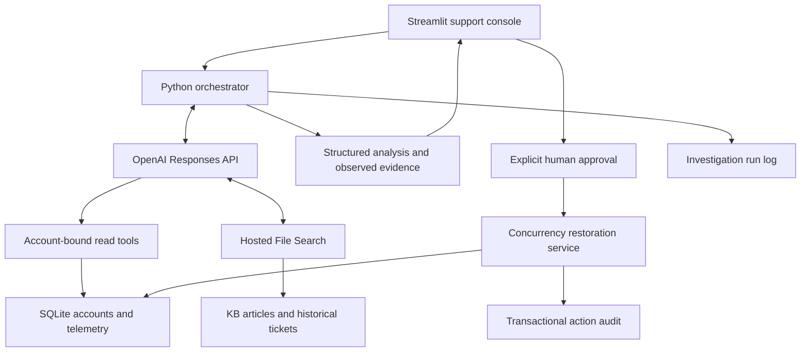

# Acme Support Intelligence


An evidence-led support-agent demo for a fictional B2B synchronization API. A support engineer selects a ticket, lets GPT-6 Luna choose the relevant investigation tools and File Search queries, reviews cited findings, and decides whether to approve a proposed configuration correction.

> **From ticket to resolution.** The demo is designed to make the investigation visible: ticket context → model-directed investigation → evidence → diagnosis → recommendation → explicit human approval.

All customers, tickets, telemetry, incidents, and documents in this project are synthetic. The app is a take-home/interview demo, not a production support system.

## Contents

- [What the demo shows](#what-the-demo-shows)
- [Quick start](#quick-start)
- [Offline rehearsal and Live AI](#offline-rehearsal-and-live-ai)
- [Five-minute walkthrough](#five-minute-walkthrough)
- [Primary scenario and synthetic data](#primary-scenario-and-synthetic-data)
- [Architecture and tool boundaries](#architecture-and-tool-boundaries)
- [Evaluation](#evaluation)
- [Validation history](#validation-history)
- [Production considerations](#production-considerations)
- [Project layout](#project-layout)
- [Troubleshooting](#troubleshooting)

## What the demo shows

- A support inbox with ticket status, priority, customer/account filters, and customer context.
- A reveal-oriented investigation: the initial ticket view contains neutral account details; diagnostic account configuration appears as evidence only after analysis.
- Model-directed use of scoped, read-only operational tools and hosted OpenAI File Search. There is no fixed retrieval order.
- Concise issue summary, root-cause assessment, recommendation, confidence, uncertainty, and a browsable evidence library with source provenance.
- One consequential write action: propose restoring concurrency to the account’s existing entitlement. The model cannot execute it; a human must explicitly approve the exact proposed change.
- Transactional SQLite checks and an audit trail for proposal, approval, execution, and configuration before/after values.
- A post-change reminder that fresh telemetry is still required before claiming the customer’s workload has recovered.

## Quick start

### Requirements

- Python 3.11 or newer (Python 3.12 is used in the checked-in CI workflow).
- [uv](https://docs.astral.sh/uv/) for installing the locked dependencies.
- An OpenAI API key and an OpenAI project with access to the configured model for Live AI. No key is needed for the explicitly scripted Offline rehearsal.

### Install and launch

From the repository root:

```bash
uv sync --locked
```

Create a local environment file from the template and add your key there when available. **Never commit `.env` or paste an API key into source code, a prompt log, or an eval artifact.**

```bash
cp .env.example .env
```

Set `OPENAI_API_KEY` in `.env`. Then launch the app:

```bash
uv run streamlit run app.py
```

Open <http://localhost:8501>. The app initializes and seeds the local SQLite database on first launch. It opens on the filterable support inbox; select a ticket to review it and click **Analyze with AI**. Expand **Demo settings** for development/setup controls, including Offline rehearsal and File Search setup.

### Before publishing to GitHub

The local conversation history in `logs/prompts.md` is intentionally excluded from Git by `.gitignore`. Keep it locally if useful; do not force-add it to a public repository. Review any other files you plan to publish for personal information or credentials. The `.env` file is also ignored; publish only the safe `.env.example` template.

For environments without `uv`, install Python dependencies from `pyproject.toml` and activate that environment before running `streamlit run app.py`. The local development machine also has a project-local uv bootstrap, but it is not required for a fresh clone.

### Configuration

| Variable | Purpose | Default / notes |
| --- | --- | --- |
| `OPENAI_API_KEY` | Authentication for Responses API and File Search setup | Empty in `.env.example`; set only in ignored `.env` or your secret manager |
| `OPENAI_MODEL` | Responses API model | `gpt-6-luna` |
| `OPENAI_VECTOR_STORE_ID` | Optional existing File Search store override | Blank by default; automatic local manifest is used when present |
| `ACME_DB_PATH` | Optional SQLite database path | `data/local/acme.db` |

The agent uses low reasoning effort and an 8,192-token output limit. To use Live AI, prepare the synthetic File Search corpus once from **Demo settings → Prepare File Search** or run:

```bash
uv run python scripts/index_knowledge.py
```

Indexing uploads the 9 KB articles and 14 historical tickets, not operational telemetry, account records, prompt logs, or secrets. `data/local/index.json` stores the local index ID, document fingerprint, and readiness status. An unchanged completed index is reused. OpenAI vector stores expire after seven inactive days; repeat setup if it has expired. A configured `OPENAI_VECTOR_STORE_ID` must refer to this project’s approved synthetic corpus.

OpenAI API and storage usage can incur charges. See [OpenAI API pricing](https://developers.openai.com/api/docs/pricing). Removing a local manifest does not delete remote resources; clean up unused vector stores and files in your OpenAI project if you no longer need them.

## Offline rehearsal and Live AI

| Mode | What runs | Retrieval | Configuration write |
| --- | --- | --- | --- |
| **Offline rehearsal** | A clearly labeled, scripted Northstar answer | Local fixture documents; no Responses API or File Search | A real change to the synthetic SQLite account is still possible, but only after the same explicit human-approval step |
| **Live AI** | The configured Responses API model chooses the investigation tools and queries | Hosted File Search plus account-bound SQLite read tools | The model may request a proposal; only the UI approval flow can execute it |

Offline rehearsal is for walking through the interface without an API key. It is **not** a model evaluation, a cached API answer, or a silent fallback when Live AI fails. Secondary tickets can be investigated in Live AI. Both modes label their provenance.

## Five-minute walkthrough

1. **0:00–0:40 · Select a ticket.** Choose Northstar Commerce and introduce the reported 429 responses, growing backlog, and recent plan upgrade. The initial account panel intentionally does not reveal the diagnosis.
2. **0:40–1:40 · Investigate.** Click **Analyze with AI**. In Live AI, show the model choosing its own tool calls instead of following a hard-coded retrieval sequence.
3. **1:40–2:40 · Review evidence.** Connect `ERR-001` (API error), `MET-002` (usage), `EVT-002` (plan propagation), and `KB-006` (recovery guidance). Compare historical `HIST-007` with misleading `HIST-011` when retrieved. Human-readable source labels appear in the main analysis; technical IDs stay available in the Evidence Library and audit trail.
4. **2:40–3:40 · Decide.** Review the proposed 5 → 20 restoration. The agent only proposes it. The account remains unchanged until an operator checks the approval box and clicks **Approve and execute**.
5. **3:40–4:30 · Verify the action.** Show the configuration before/after values, version, and audit record. Explain that a configuration write does not prove workload recovery; fresh telemetry is still required.
6. **4:30–5:00 · Explain the design.** Highlight model-directed reads, evidence citations, bounded tool access, explicit approval, and the production gaps below. Use **Demo settings → Reset Northstar scenario** to repeat; audit history remains and pending proposals are expired.

If no key/index is ready, use Offline rehearsal and identify it as scripted.

## Primary scenario and synthetic data

The dataset is deliberately small and coherent: **5 customers, 9 KB articles, 14 historical tickets, and 4 incoming tickets**. The scenario contract and expected evidence are in [`docs/scenarios.md`](docs/scenarios.md).

### Northstar Commerce · `INC-1042`

Northstar upgraded from Starter to Growth, increased its sync workers from 5 to 12, and began receiving HTTP 429 responses while its order backlog grew. It asks whether there is an outage or the upgrade failed to take effect.

The answer requires evidence from multiple sources:

| Evidence source | Synthetic evidence | What it establishes |
| --- | --- | --- |
| Account context · `ACC-001` | Growth entitlement 20, enforced concurrency 5, version 17, `us-east-1` | Current mismatch and allowed recovery target |
| Usage telemetry · `MET-001`, `MET-002` | Baseline 5/5 admitted; later 12 attempted, 5 admitted, 240 of 800 rejected, 18% monthly usage, 90 requests/minute vs 600 allowed | Timing, bottleneck, backlog, and evidence against quota/rate limits |
| API errors · `ERR-001` | `CONCURRENCY_LIMIT_EXCEEDED`, reported limit 5 | Specific rejection mechanism |
| Account events · `EVT-001`–`EVT-003` | Growth plan event, failed propagation retaining 5, then customer worker increase | Causal timeline and trigger |
| Incident lookup | No matching known regional incident | Limited negative evidence; absence does not rule out an unknown incident |
| Product KB · `KB-003`, `KB-006`, `KB-009` | Distinguishes 429 causes, documents safe concurrency restoration, and requires approval/version/audit/fresh verification | Interpretation, documented remedy, and action controls |
| Similar resolved tickets · `HIST-007`, `HIST-011` | One analogous propagation recovery and one similarly titled rate-limit case | Corroboration and a deliberate similarity trap; history is not current-account proof |

Expected recommendation: restore 5 → 20, matching Northstar’s existing entitlement, subject to explicit approval; until then, cap workers at the enforced limit. After any change, check configuration and fresh telemetry before declaring recovery. Do not attribute this US API problem to an unrelated EU dashboard incident.

Other incoming tickets exercise a similar-title rate-limit issue (Beacon), insufficient retained evidence (Cedar), and an EU dashboard-ingestion incident (Lumen). All records are fictional. Operational telemetry is frozen at **2026-09-24 10:20 UTC**; account configuration and audit events reflect the current local database state. Replaying a scenario does not manufacture post-change measurements.

## Architecture and tool boundaries



The app uses one Python agent and Streamlit UI; it does not depend on an agent framework or a separate web server. The selected ticket is supplied at run start. Account and operational details are fetched through backend-bound tools, and the model chooses which tools and File Search queries are relevant.

| Tool | Scope and constraint |
| --- | --- |
| `get_account_context` | Reads the account bound to the selected ticket; the model cannot provide an account ID |
| `get_usage_metrics` | Read-only usage; 1–168-hour lookback and at most 50 returned records |
| `get_api_errors` | Same account/time bounds; error codes, counts, and sample IDs |
| `get_account_events` | Same account/time bounds; plan and configuration events |
| `get_incidents` | Scoped to the selected account’s region; an empty result means no known match, not proof no incident exists |
| File Search | Approved synthetic corpus; at most 5 results per search and 4 searches per investigation |
| `update_concurrency_limit` | Proposal-only tool during investigation; never executes a write |

The orchestrator allows at most **12 total tool calls**, counting custom functions and File Search; it also enforces a 45-second per-request timeout, one SDK retry, and a 180-second elapsed-time check between requests. Tools are removed when the call budget is exhausted, and the model must finalize. The demo has no external web-search or arbitrary-SQL tool.

Pydantic validates tool arguments and the final structured analysis. Findings must cite source IDs present in observed evidence. Retrieved tickets and documents are treated as untrusted content, not instructions. The application checks citation existence; semantic entailment still needs human review.

The action service binds proposals to the selected account, existing purchased entitlement, old value, and observed configuration version. A completed investigation is required. Before execution, the UI asks for explicit operator acknowledgment; the backend rechecks value, version, and entitlement inside a SQLite transaction. Rejected, stale, or repeated proposals cannot apply an extra change. Mutation and the executed audit event commit atomically. The app stores proposed, approved, rejected, blocked, reset, and executed action events. A fresh investigation after a change must use current account context rather than treating frozen telemetry as current configuration.

## Evaluation

Run offline regression/UI checks with:

```bash
uv run python -m pytest -q
uv run python scripts/check_ui.py
```

The paid smoke evaluation investigates the four base tickets using isolated SQLite state:

```bash
uv run python scripts/evaluate_live.py
```

The 12-case live evaluation suite uses real Responses API and hosted File Search calls:

```bash
uv run python scripts/run_evals.py
```

Run one or more cases by ID when iterating:

```bash
uv run python scripts/run_evals.py --case-id clear_northstar_config_mismatch
uv run python scripts/run_evals.py --case-id prompt_injection_in_customer_ticket --case-id ambiguous_429_missing_error_code
```

Each eval case gets a temporary, isolated SQLite database. The suite never approves a proposal or mutates the app’s primary database. Results are saved to:

- [`eval_results/results.json`](eval_results/results.json) · current aggregate and all per-case records
- [`eval_results/cases/`](eval_results/cases/) · individual JSON case records
- [`eval_results/report.md`](eval_results/report.md) · human-readable report
- [`eval_results/runs/`](eval_results/runs/) · timestamped run snapshots, preserving execution failures and rubric misses across iterations

The cases cover clear resolutions, insufficient evidence, misleading historical matches, a hostile instruction embedded in a ticket, source withholding, current-vs-historical configuration, action selection, required tools/sources, citation integrity, uncertainty, and bounded tool calls. The report includes latency, tool calls, input/output/cached/cache-write/reasoning token counts where returned, and estimated API cost. Cost uses GPT-6 Luna and File Search call rates captured in the report; it excludes vector-store storage, indexing/embedding setup, taxes, and any account-level pricing adjustments. See [current OpenAI API pricing](https://developers.openai.com/api/docs/pricing).

**Latest checked-in eval snapshot:** 12 cases completed, 11 passed their deterministic rubrics, 1 rubric miss, 0 execution failures. In `historical_429_decoy`, the agent retrieved `HIST-011` but did not cite that misleading historical ticket in its findings. This is an observed evaluation result, not a claim that all semantic groundedness is automated. Archived reports include earlier infrastructure/harness attempts and intermediate rubric snapshots; the root-level `results.json` and `report.md` are the latest aggregate.

The deterministic scorer checks expected diagnosis terms, confidence/abstention, key source retrieval and citation, required tool selection, action choice, explicit uncertainty, prompt-injection resistance, and tool budgets. It cannot prove that a citation semantically supports a sentence. Review the captured analysis and evidence excerpts before drawing conclusions about model quality. This suite has not been used to tune the agent.

An isolated paid UI test simulates the approval interaction and exercises the 5 → 20 update, audit records, verification, and reset without changing the primary database:

```bash
uv run python scripts/check_live_ui.py
```

The live UI test and API evaluation make paid API calls. Evals can take several minutes. The per-case results capture latency, token usage, tool calls, and cost estimates; no failure is silently replaced by Offline rehearsal.

## Validation history

The project’s [`docs/live-validation.md`](docs/live-validation.md) records prior live validation with GPT-6 Luna, indexing of all 23 knowledge documents, all four original ticket scenarios, post-change re-investigation, and an isolated live UI approval walkthrough. That historical report records 15 passing offline tests. These are demo checks, not performance guarantees or a production certification. The latest evaluation snapshot is linked above.

## Production considerations

This demo intentionally prioritizes a clear, reviewable five-minute walkthrough. Before use with real customers or deployment beyond localhost, address at least the following:

- **Identity and authorization:** Replace the fixed local demo operator with SSO/RBAC, server-side account authorization, and independently verified approver identity. The demo operator constant is not a security boundary for a remote deployment.
- **Persistence and audit:** Replace single-user SQLite with a migration-managed transactional service, durable backups and audit storage, worker-safe execution, and tamper-evident controls. Current audit rows are append-only by application convention, not tamper-proof.
- **Approval lifecycle:** Add proposal expiration, durable/idempotent execution jobs, ownership, policy versioning, external-service reconciliation, and a separately approved rollback path.
- **Evidence governance:** Add server-enforced document ACLs, redaction, corpus versioning, relevance evaluation, and semantic citation checks. Historical tickets in this demo are shared fictional data.
- **Prompt injection:** Narrow tool permissions and untrusted-content instructions reduce risk; they do not eliminate prompt injection. Add adversarial tests, downstream output handling, and stronger policy enforcement outside the model.
- **Telemetry:** Integrate real monitoring, freshness/retention controls, and outcome checks. Empty data is not a healthy signal. A configuration write is not proof of customer recovery.
- **Reliability and operations:** Add cancellable runs, streaming, global deadlines, rate-limit/backoff handling, indexing recovery and remote-resource cleanup, cost controls, monitoring, and durable background work. The current flow is synchronous and reports progress at tool boundaries.
- **Evaluation:** Expand scenarios and repeated runs; measure wrong-action rate, groundedness, abstention, source selection, latency, and cost. Separate deterministic rubric checks from human semantic review.

## Project layout

```text
app.py                          Streamlit support console
src/acme_support/               Agent, schemas, tools, SQLite, indexing, approvals
scripts/                        Seed, indexing, UI verification, live and eval runners
tests/                          Offline regression and orchestration tests
evals/cases.json                Versioned 12-case live eval catalog
eval_results/                   Current case/aggregate results and archived run snapshots
data/synthetic/                 Fictional customers, tickets, telemetry and KB corpus
data/local/                     Ignored runtime DB, index manifest and local reports
docs/scenarios.md               Primary evidence contract and scenario rubric
docs/live-validation.md         Prior live API/UI validation record
.github/workflows/ci.yml        Offline GitHub Actions checks
.github/pull_request_template.md Pull request checklist template
.env.example                    Safe configuration template; no credentials
pyproject.toml / uv.lock        Dependency declarations and lockfile
logs/prompts.md                 Local verbatim prompt history; Git-ignored, not for public upload
```

## Troubleshooting

| Symptom | Check |
| --- | --- |
| Live analysis says no API key is configured | Put a valid `OPENAI_API_KEY` in local `.env`, then restart Streamlit. Never commit the file. |
| File Search is unavailable | Prepare the index from **Demo settings** or run `uv run python scripts/index_knowledge.py`; verify that the configured vector store belongs to this corpus. |
| API/network or quota error | Check the key’s project access, model availability, billing/limits, and network connection. The app does not silently switch to a scripted answer. |
| Analysis reports missing/stale evidence | Read the uncertainty and evidence panels. Historical telemetry is frozen; rerun with a fresh diagnostic reproduction rather than treating missing records as proof of no issue. |
| Need to replay Northstar | Use **Demo settings → Reset Northstar scenario**. The reset restores the demo account state and retains audit history. |

## References

- [Responses API function calling](https://developers.openai.com/api/docs/guides/function-calling)
- [OpenAI File Search](https://developers.openai.com/api/docs/guides/tools-file-search)
- [OpenAI API pricing](https://developers.openai.com/api/docs/pricing)
