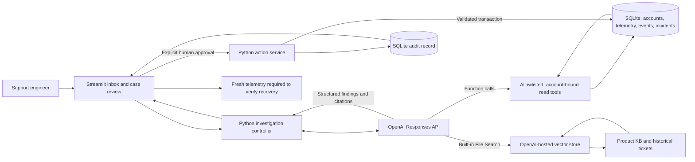

# Acme Technical Support Investigation Agent


The Acme Technical Support Investigation Agent is a take-home demo for Acme Cloud, a fictional cloud software provider. It explores how an internal support engineer could investigate a customer issue across operational signals and product knowledge, then review a grounded recommendation before approving a consequential change.

> **From ticket to resolution.** The agent investigates; the support engineer remains accountable for the action.

All customers, tickets, telemetry, incidents, and knowledge documents are synthetic. This is an interview demo, not a production support system.

## The customer problem

Acme Cloud’s customers use **Acme Sync API v2** to process business data. When a customer reports failed syncs, a growing backlog, or HTTP 429 errors, a support engineer may need to reconcile the ticket with account configuration, API telemetry, incident status, product guidance, and similar past cases. A similar-looking ticket can point to the wrong fix, and a configuration change can have consequences.

The demo centers on **Northstar Commerce**. After upgrading its plan and increasing its workers, Northstar reports 429 responses and a growing order backlog. The engineer needs to determine whether the issue is an incident, request pacing, exhausted quota, or a configuration mismatch—and establish what the evidence supports before recommending an action.

| | |
| --- | --- |
| **User** | Internal support engineer reviewing a customer ticket |
| **Problem** | Investigation context is distributed across structured operational records and unstructured support knowledge |
| **Solution** | An evidence-led assistant that selects relevant sources, explains its diagnosis and uncertainty, and presents a bounded recommendation |
| **Expected value** | Shorter investigations and lower mean time to resolution (MTTR), more Tier-2 capacity, fewer avoidable engineering escalations, and clearer customer responses |

These are intended outcomes to test in a pilot, not measured results or guaranteed improvements.

## Why OpenAI Platform

The **OpenAI Platform** is the agent’s reasoning and retrieval surface:

- **Responses API** orchestrates the investigation and returns a structured analysis. The model decides which available tools and retrieval sources are useful; the app does not impose a fixed lookup sequence.
- **Function calling** connects the model to narrowly scoped operational tools for account context, usage metrics, API errors, incidents, and account events. A separate proposal-only function can request a configuration change.
- **File Search** retrieves unstructured synthetic product knowledge and historical support tickets from a hosted vector store. These sources provide guidance and historical analogies, not proof of a customer’s current state.

The Streamlit app presents the case and evidence. Python validates tool calls and actions; SQLite stores the synthetic operational data, investigation records, proposals, and audit events.

## Architecture



In this demo, structured operational reads go through Python function tools backed by SQLite. Unstructured KB and ticket-history retrieval uses the Responses API’s File Search tool and hosted vector store. The model proposes; the application enforces the action boundary and the human approves.

## End-to-end workflow

**Ticket → investigate → gather evidence → root cause → recommendation → human approval → action, audit, and verification**

1. The engineer selects a ticket from the filterable inbox. The initial account view shows neutral context rather than revealing the diagnosis.
2. The Responses API model chooses among the allowed operational functions and File Search, within application-enforced argument and call limits.
3. The app collects the source records and displays evidence, findings, citations, confidence, and uncertainty.
4. If supported, the model may request a narrowly defined proposal. The backend checks that the target is the account’s existing entitlement and that the current configuration version matches.
5. The engineer reviews and explicitly approves or rejects the proposal. Only the app’s approval path can execute the write.
6. The app records the outcome and before/after configuration in an audit trail. Fresh telemetry is still needed before the engineer can say the customer’s workload recovered.

## Five-minute demo story

1. **Introduce the customer.** Northstar upgraded its plan, increased its sync workers, and now sees 429 errors while its order backlog grows. The ticket alone does not reveal why.
2. **Start the investigation.** Click **Analyze with AI** and show how the model chooses which operational tools and knowledge sources to consult.
3. **Connect the evidence.** Walk from the observed error and usage pattern to the account state and timeline. Use the product guidance to interpret the error; treat similar past tickets as context, not current-account evidence.
4. **State the diagnosis and recommendation.** Explain the configuration mismatch and the proposed restoration to the already-purchased entitlement. Call out any remaining uncertainty.
5. **Make the human decision.** The model cannot execute the change. The engineer reviews the exact values and explicitly approves.
6. **Close with verification.** Show the updated configuration and audit event, then point out that fresh telemetry is needed to confirm customer recovery.

The detailed scenario contract, evidence map, secondary cases, and review rubric are in [docs/scenarios.md](docs/scenarios.md). The offline rehearsal is scripted and clearly labeled; do not present it as a live model investigation.

## Expected value and pilot measures

The working hypothesis is that an evidence-gathering agent can reduce time spent assembling context and improve the consistency of support decisions. A pilot should compare representative tickets against a baseline and track:

- Investigation time to first evidence-backed diagnosis and ticket-level time to resolution, segmented by issue type and severity.
- Tier-2 cases handled per engineer and the rate of avoidable engineering escalations.
- Customer response time and CSAT, interpreted alongside resolution quality and re-open rates.
- Diagnosis accuracy, evidence coverage, citation quality, appropriate uncertainty, and unsafe or unsupported recommendation rate.
- Human approval, rejection, and override rates; stale-action blocks; and post-action verification completion.
- Median and p95 model latency, tool calls, tokens, and estimated cost per investigation or resolved ticket.

No performance target or percentage improvement is claimed by this demo. A pilot should establish baseline values, define success thresholds in advance, and include human review of semantic grounding and action safety.

## Design and safety boundaries

The implementation uses a least-privilege tool surface and aims to make important controls visible and testable without claiming production readiness.

### Tool scope and orchestration

| Capability | Demo boundary |
| --- | --- |
| Account context | Derived from the selected ticket; the model cannot choose an account ID |
| Usage, API errors, and account events | Read-only, account-bound, time-window constrained, with at most 50 returned records |
| Incident lookup | Filtered to the selected account’s region; no match means no known matching incident, not proof that none exists |
| File Search | Synthetic KB and ticket-history corpus; up to 5 results per search and 4 searches per investigation |
| Action request | Proposal-only **update_concurrency_limit**; the function itself never writes configuration |
| Overall investigation | At most 12 tool calls; 45-second API request timeout, one SDK retry, and a 180-second elapsed-time check between API calls |

There is no arbitrary SQL or external web-search tool. Pydantic validates function arguments and the structured final response. The app checks that cited source IDs were actually observed; this checks citation presence, not whether each source semantically supports its claim.

### Human approval, action, and audit

A proposal is bound to the selected account, its current value, existing entitlement, and configuration version. The backend rechecks these values in a SQLite transaction. Rejected, stale, repeated, or out-of-scope proposals cannot perform the requested update. Approval, execution, and the before/after state are recorded transactionally.

This is a local single-user demo: the operator identity is fixed, SQLite audit rows are not tamper-proof, and there is no real customer-system integration. A successful configuration write is not proof that the customer recovered; the app explicitly calls for fresh telemetry.

### Grounding, prompt injection, and privacy

Tickets, retrieved documents, and tool outputs are treated as untrusted evidence rather than instructions. The agent is told to use only its provided tools, distinguish current state from historical records, and express uncertainty when evidence is missing. The prompt-injection eval is a useful regression case, not proof that prompt injection is solved.

The included data is synthetic. In a real deployment, customer data sent to the model or stored in retrieval indexes would require documented data handling, minimization, retention, access controls, and security review. Local SQLite records each investigation’s status, observed evidence and tool trace; the trace includes response IDs, returned usage details, and elapsed time where available. The UI can export a run’s evidence, trace, and related audit events as JSON. Model private reasoning is not presented as an audit trail.

## Evaluation

The repository separates deterministic offline checks from paid live model evaluations.

Run offline tests and the Streamlit UI smoke check:

```bash
uv run python -m pytest -q
uv run python scripts/check_ui.py
```

The live evaluation suite uses real Responses API and hosted File Search calls. It creates an isolated SQLite database for each case and does not approve proposals or modify the app’s primary database:

```bash
uv run python scripts/run_evals.py
uv run python scripts/run_evals.py --case-id clear_northstar_config_mismatch
uv run python scripts/run_evals.py --case-id prompt_injection_in_customer_ticket --case-id ambiguous_429_missing_error_code
```

The paid four-ticket API smoke test and isolated live approval UI test are available separately:

```bash
uv run python scripts/evaluate_live.py
uv run python scripts/check_live_ui.py
```

The 12-case catalog covers clear diagnoses, insufficient evidence, misleading historical matches, prompt injection, source withholding, current-versus-historical configuration, tool choice, citation integrity, uncertainty, and call budgets. The deterministic rubrics check expected diagnosis terms, confidence or abstention, source retrieval and citation, tool selection, action choice, uncertainty, injection resistance, and tool limits. They do **not** prove that a citation semantically entails a finding; review the captured excerpts and analysis.

### Checked-in live result

The current checked-in report was generated **September 28, 2026**. It records **12 completed cases, 11 rubric passes, 1 rubric miss, and 0 execution failures**. Mean latency was **12.229 seconds**, p95 **18.839 seconds**, with **74 tool calls**, **269,249 tokens**, and **$0.040243 estimated API cost** for that run.

The rubric miss was **historical_429_decoy**: the agent retrieved a misleading historical rate-limit ticket but did not cite it in its findings. This is one small snapshot, not a general accuracy or production-readiness claim. Evals have not been used to tune the agent. Results include per-case detail, cost assumptions, and earlier run snapshots:

- [Human-readable current report](eval_results/report.md)
- [Machine-readable aggregate and per-case results](eval_results/results.json)
- [Eval case definitions](evals/cases.json)
- [Timestamped run history](eval_results/runs/)

Live evaluation makes paid API calls. Reported cost is an estimate from the price assumptions stored with the run; it excludes vector-store storage and indexing/embedding setup. See [OpenAI API pricing](https://developers.openai.com/api/docs/pricing).

## Path to production

Before handling real customer tickets, the design would need:

- **Real integrations:** Support system, account/configuration service, telemetry and incident sources, with tested identity and data contracts.
- **Identity and access:** SSO, RBAC, server-side account authorization, verified approver identity, and document-level retrieval ACLs.
- **Durable actions:** Production persistence, migrations, durable approval lifecycle, idempotent writes, expiration, reconciliation, and separately governed rollback.
- **Security and privacy:** PII minimization/redaction, retention and deletion policies, secrets management, threat modeling, audit protection, and adversarial testing.
- **Reliability and operations:** Monitoring, alerting, cancellation, global deadlines, rate-limit handling, retry strategy, index lifecycle, cost controls, and service-level expectations.
- **Expanded evaluation:** More representative and adversarial cases, repeated runs, semantic citation review, human outcome review, and monitoring for regressions after model or prompt changes.

The live validation history and its limits are documented in [docs/live-validation.md](docs/live-validation.md).

## Quick start

### Requirements

- Python 3.11 or newer (CI uses Python 3.12).
- [uv](https://docs.astral.sh/uv/) for locked dependency installation.
- An OpenAI API key and access to the configured model for Live AI. Offline rehearsal does not require a key.

### Install and run

From the repository root:

```bash
uv sync --locked
cp .env.example .env
```

Set **OPENAI_API_KEY** in the ignored **.env** file, then start Streamlit:

```bash
uv run streamlit run app.py
```

Open <http://localhost:8501>, select a ticket, and click **Analyze with AI**. For Live AI, prepare the File Search index from **Demo settings → Prepare File Search** or run:

```bash
uv run python scripts/index_knowledge.py
```

Indexing uploads only the 9 synthetic KB articles and 14 historical tickets. It does not upload operational telemetry, account records, prompt logs, or secrets. The local **data/local/index.json** manifest tracks the vector-store ID, corpus fingerprint, and readiness. An unchanged completed index is reused. OpenAI vector stores expire after seven inactive days, so setup may need to be repeated. API and storage usage may incur charges.

Offline rehearsal is a scripted Northstar walkthrough, not model output, a cached answer, or a fallback for Live AI failures. The mode is labeled in the UI. The secondary tickets require Live AI.

### Configuration

| Variable | Purpose | Default / notes |
| --- | --- | --- |
| **OPENAI_API_KEY** | Responses API and File Search authentication | Empty in .env.example; keep the value in ignored .env or a secret manager |
| **OPENAI_MODEL** | Model used by Responses API | **gpt-6-luna** in current config; model is a configuration detail, not the product premise |
| **OPENAI_VECTOR_STORE_ID** | Optional existing File Search store override | Blank by default; otherwise the local index manifest is used |
| **ACME_DB_PATH** | SQLite path | **data/local/acme.db** |

The agent currently uses low reasoning effort and an 8,192-token output limit. Never commit .env, credentials, or **logs/prompts.md**. The prompt log is intentionally excluded by .gitignore; publish only the safe .env.example template.

## Project structure

```text
app.py                          Streamlit inbox and support case UI
src/acme_support/               Responses API agent, tools, schemas, SQLite, actions
scripts/                        Indexing, seeding, UI checks, and evaluation runners
tests/                          Offline regression and orchestration tests
evals/cases.json                Versioned 12-case live evaluation catalog
eval_results/                   Current results and archived run snapshots
data/synthetic/                 Fictional accounts, tickets, telemetry, and KB corpus
data/local/                     Ignored runtime database and index manifest
docs/scenarios.md               Scenario contract and evaluation rubric
docs/live-validation.md         Prior live API and UI validation notes
.github/workflows/ci.yml        Offline GitHub Actions checks
pyproject.toml / uv.lock        Dependencies and lockfile
.env.example                    Safe configuration template
```

## Troubleshooting

| Symptom | Check |
| --- | --- |
| Live AI says no API key is configured | Set a valid OPENAI_API_KEY in local .env, then restart Streamlit. Never commit the file. |
| File Search is unavailable | Prepare the index from Demo settings or run **uv run python scripts/index_knowledge.py**; confirm the vector store is for this synthetic corpus and has not expired. |
| API, network, or quota error | Check key/project access, model access, billing limits, and network. The app does not silently switch to scripted output. |
| The finding reports missing evidence | Review the uncertainty panel and gather a fresh request ID, timestamp, or diagnostic sample. Missing records do not establish that no issue occurred. |
| Need to replay Northstar | Use **Demo settings → Reset Northstar scenario**. It resets the demo account while retaining audit history. |

## OpenAI Platform references

- [Responses API](https://developers.openai.com/api/docs/guides/text)
- [Function calling](https://developers.openai.com/api/docs/guides/function-calling)
- [File Search](https://developers.openai.com/api/docs/guides/tools-file-search)
- [API pricing](https://developers.openai.com/api/docs/pricing)
